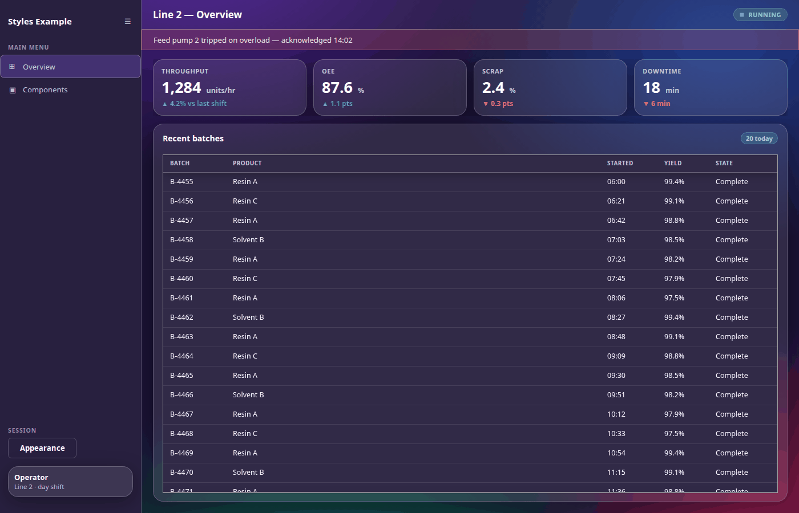
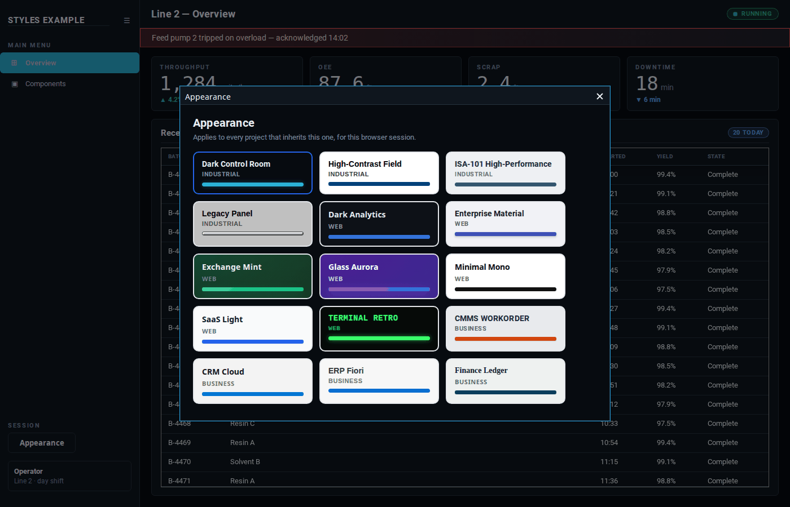
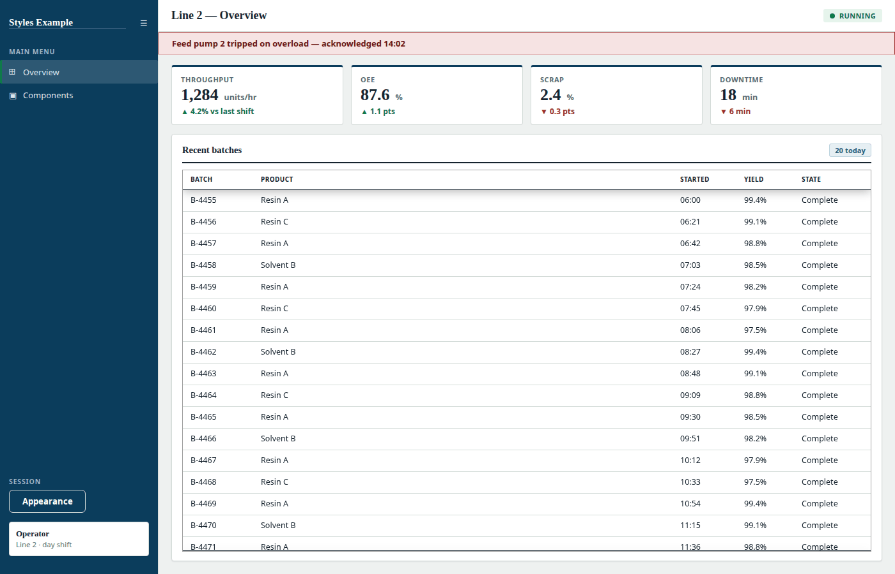
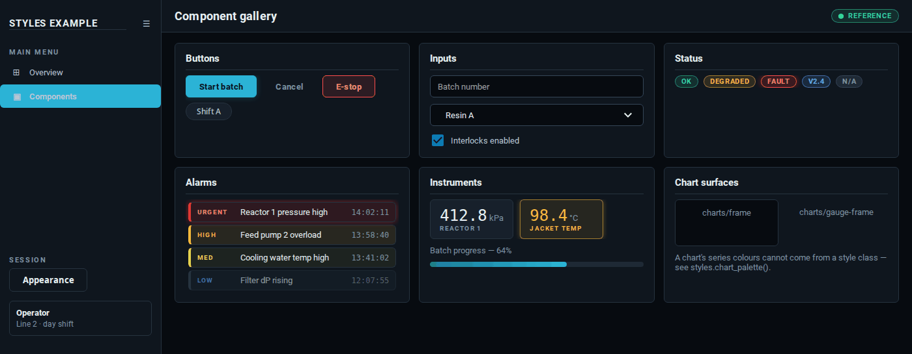

# Ignition Styles Template

One look-and-feel, 19 ways, for Ignition Perspective. Import it, set it as
your project's parent, and your project is themed. Switch pack at runtime and
everything re-themes at once.



Each pack is a complete set of 69 Perspective style classes, plus the
descendant CSS that makes components Perspective renders for itself — table
headers and rows, buttons, dropdowns, popups, scrollbars — follow the pack too.
A style class alone cannot reach inside a component; that is the gap this fills.

## Install

1. **Download both zips from the [latest release](../../releases/latest).**
   They are the release assets — *Source code (zip)* is this repository, not the
   projects.
2. **Import `Styles_Template.zip`** in the Gateway: **Platform → Project →
   Import**.
3. **Set your project's parent project to `Styles_Template`.** That is one
   project setting — in `project.json` it is the line
   `"parent": "Styles_Template"`.

That is the whole wiring. Inheritance gives your project every style class, the
Appearance picker and the `session.custom.style` property at once.

Optionally import **`Styles_Example.zip`** too: a small launchable project — a
dock and two pages — that wears every class in the contract. Import it to look
around, then delete it. Nothing inherits from it, and the screenshots on this
page are all of it.

Requires **Ignition 8.3** with Perspective.

## Switching packs



The picker is inherited, so you do not build it: drop the `Styles/Button` view
somewhere persistent, like a sidebar or a toolbar. Every tile previews itself in
its own pack, so you are choosing from the real thing.

Out of the box the choice lasts for the browser session. To make it stick, point
the shared script library at a datasource — one small table — and the same view
becomes the bootstrapper that re-applies the stored pack on startup.

## The same project in other packs



That is the same page as the first screenshot. Nothing about it changed except
`session.custom.style`.



And the example's other page, which exists to put every class in the contract on
screen at once.

## Using it in your own project

Components never name a pack. They bind `style.classes` to an expression:

```text
{session.custom.style} + '/tables/frame'
```

so one session property re-themes every bound component at once. That naming
consistency is the entire contract: every pack defines the same class names,
grouped as `containers/`, `text/`, `nav/`, `tables/`, `buttons/`, `inputs/`,
`status/`, `kpi/`, `alarms/`, `charts/`, `progress/` and `readouts/`.

### Two things that fail silently

Both render a page that looks broken with nothing in the logs:

- **If your project overrides session props at all, it must set
  `custom.style`.** A child's session props *replace* the parent's rather than
  merging, so without that one property every bound component renders as a red
  ERROR bar.
- **Do not give your project its own stylesheet resource.** It replaces the
  inherited one outright — a child adding one rule loses every shared rule,
  including all the table and control chrome. Put one-off styling in component
  props instead.

## The packs

| Pack | Category | |
| --- | --- | --- |
| **Dark Control Room** | Industrial | dark |
| **High-Contrast Field** | Industrial | light |
| **ISA-101 High-Performance** | Industrial | light |
| **Legacy Panel** | Industrial | light |
| **Dark Analytics** | Web | dark |
| **Enterprise Material** | Web | light |
| **Exchange Mint** | Web | dark |
| **Glass Aurora** | Web | dark |
| **Minimal Mono** | Web | light |
| **SaaS Light** | Web | light |
| **Terminal Retro** | Web | dark |
| **CMMS Workorder** | Business | light |
| **CRM Cloud** | Business | light |
| **ERP Fiori** | Business | light |
| **Finance Ledger** | Business | light |
| **ProjectOps Agile** | Business | light |
| **WMS Scanner** | Business | light |
| **Leather Journal (Night)** | Character | dark |
| **Leather Journal** | Character | light |

Every pack defines all 69 classes, so switching between any two is safe.
"Dark" describes the page surface — several light packs still use a dark
navigation dock.

## Licence

[Apache-2.0](LICENSE). Use them, fork them, ship them in your own projects.
